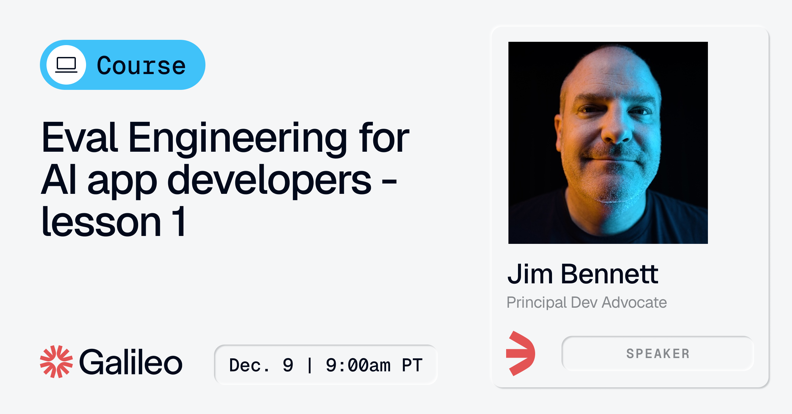
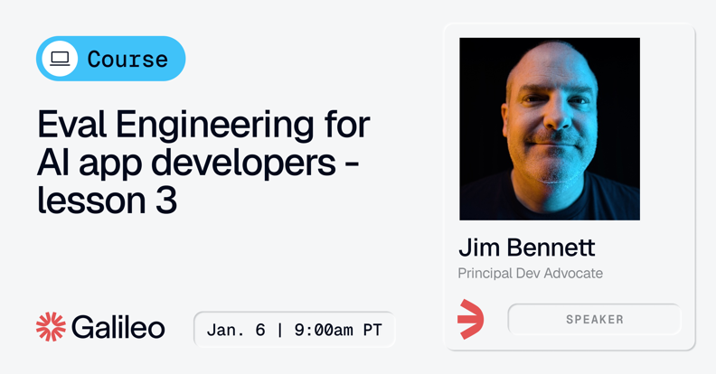
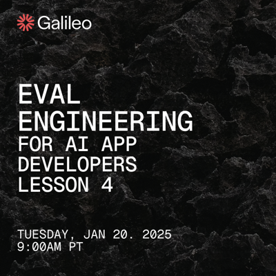
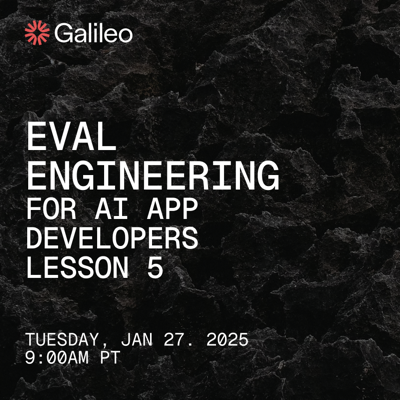

# Eval Engineering for AI Developers

This repo contains all the example code needed for the Eval Engineering for AI Developers course taught by Galileo.

## Watch past lessons

You can catch recordings of all the past lessons on the [Galileo YouTube Channel](https://www.youtube.com/@rungalileo).

## Sign up for the lessons

You can sign up for the remaining lessons for the first cohort from these links:

## Prerequisites

To use these sample apps, you will need:

- Python 3.10 or greater installed
- A [Galileo account](https://galileo.ai/sign-up). The free account is fine.
- An [OpenAI API key](https://platform.openai.com/api-keys).

## Set up the code

To set up each example, you will need to:

- Clone this repo
- Create a new virtual environment
- Install the packages defined in the `requirements.txt` or `pyproject.toml` file in each repo
- Copy the provided `.env.example` files to `.env`
- Fill in the relevant details in the `.env` file

## Contents of this repo

This repo contains Python code for the course, broken down by lesson and section in the lesson.

| Lesson | Sample             | Link |
| :----- | :----------------- | :--- |
| 1      | Basic chatbot      | [Code](./lesson-1/1-basic-chatbot/) |
| 1      | Chatbot with evals | [Code](./lesson-1/2-chatbot-with-evals/) |
| 1      | Fixed chatbot      | [Code](./lesson-1/3-fixed-chatbot/) |
| 2      | Runzi              | [Code](./lesson-2/runzi/) |
| 3      | Runzi              | [Datasets, prompts, and scripts](./lesson-3/) |
